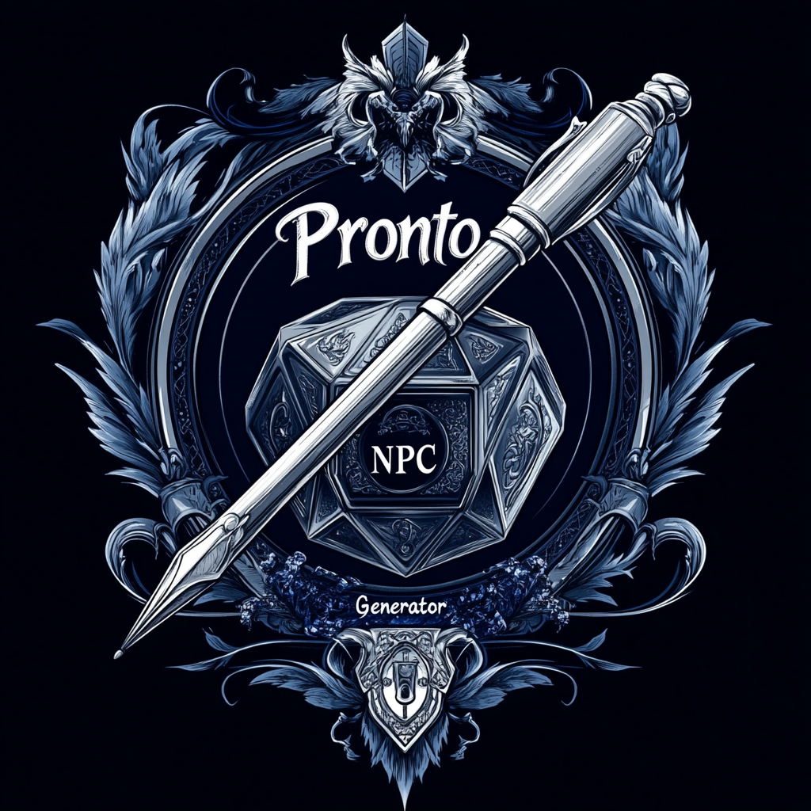

# 📜 Pronto NPC Generator



**_"Where Every Character Has a Story."_**

---

**Pronto NPC Generator** is a web-based application that allows users to randomly create NPC (Non-Player Character) profiles for different gaming systems.  
It is designed to support both **universal systems** (global) and **user-specific custom systems**.

This project uses:

- **Frontend:** React / Next.js
- **Backend:** Python / Django
- **Database:** MySQL

---

## 🎭 Project Philosophy

Unlike traditional "stat block" generators that focus heavily on combat stats, numbers, and game mechanics,  
**NPC Generator** is opinionated toward a **storytelling-first** approach.

The goal is to **enrich world-building** and **deepen character immersion** by focusing on elements like:

- Characteristic traits (personality, quirks)
- Deep wants, needs, and motivations
- Physical appearance (hair, eyes, scars, height, build)
- Gender, age categories, and race/species
- Professions and vocations
- Hometowns, regions, and locations
- Social groupings and cultural classifications

In short:  
> **_"More about who they are, rather than just what they can do."_**

---

## ✨ Features

- Create and browse **Global Systems** (available to all users).
- Create **Custom Systems** visible only to you.
- Automatically generate rich, story-driven NPCs.
- Future expansions: user-created templates, profession generators, relationship webs, and more!

---

## 🗂️ Current Backend Model: `System`

The `System` model represents the different RPG/game systems users can generate NPCs for.

| Field | Purpose |
|:------|:--------|
| `system_name` | Name of the system (e.g., "D&D 5e", "Starfinder", "Custom Homebrew"). |
| `description` | Short description of the system. |
| `is_global` | Boolean flag — true if this system is available to everyone. |
| `owner` | The user who created a private/custom system (null for global systems). |
| `created_at` | When it was created. |
| `updated_at` | When it was last modified. |

---

## ⚙️ Quick Tech Overview

- **Django REST Framework** for API endpoints
- **Next.js (React)** frontend for dynamic and interactive page experiences
- **MySQL or PostgreSQL** for database management
- **Authentication** using Django's built-in auth system (expandable to JWT or OAuth if needed)

---

## 🔮 Future Vision

- Expand NPC generation with **modular templates**.
- Allow **user-driven system sharing** (private group visibility).
- Add **AI-assisted character traits** and plot hooks.
- Include **visual avatars** and **symbolic descriptions** using AI imagery or custom uploads.
- Enable **"community systems"** where multiple users collaborate on a custom world.

---

## 🤝 Contributing

This is an early-stage project!  
Feature requests, ideas, and creative brainstorming are welcome.  
Pull Requests will be reviewed thoughtfully — storytelling-first designs are prioritized!

---

> **Remember:** In every world, characters are the heart of the story.  
> Stats may tell you how strong they are.  
> But stories tell you **why** they fight.

---

## API Documentation - Swagger UI

The API documentation is available as a Swagger UI, which provides an interactive interface to explore the API endpoints.
To launch the Swagger UI, run the following command in the terminal:

```text
docker run -p 8080:8080 -e SWAGGER_JSON=/schema.yml -v ${PWD}/schema.yml:/schema.yml swaggerapi/swagger-ui
```

Next open your browser and navigate to `http://localhost:8080` to view the API documentation.
(Note: If the "Try it out" button in Swagger UI uses the wrong port, ensure your `settings.py` `SPECTACULAR_SETTINGS` includes the `SERVERS` configuration pointing to your Django server's port, e.g., `http://127.0.0.1:8000`).

### Automating Swagger UI Workflow

To streamline the schema generation and Swagger UI launch, a Python helper script `swagger_helper.py` is provided. This script should be placed in your project's root directory (where `manage.py` is located).

**Usage:**

Before running the script, ensure your Python virtual environment is activated.

```text
# Example: Activate your virtual environment
cd D:\Python-Django\pronto_npc_backend
.\.venv\Scripts\Activate.ps1
```

Once activated, you can run `swagger_helper.py` with the following options:

- **Generate `schema.yml` only:**
    This command runs `py manage.py spectacular --color --file schema.yml` to update your API schema.

    ```text
    python swagger_helper.py --generate-schema
    # or
    python swagger_helper.py -g

    ```

- **Launch Swagger UI Docker container only:**
    This command starts the Docker container, assuming `schema.yml` already exists in your project root.

    ```text
    python swagger_helper.py --launch-docker
    # or
    python swagger_helper.py -l

    ```

    _After running, open your browser to `http://localhost:8080`._

- **Generate schema and then launch Docker container (recommended workflow):**
    This option first generates the latest `schema.yml` and then automatically launches the Swagger UI Docker container.

    ```text
    python swagger_helper.py --all
    # or
    python swagger_helper.py -a

    ```

    _After_ the script completes schema generation and launches Docker, open your browser to _`http://localhost:8080`._

- **Get help/view options:**

    ```text
    python swagger_helper.py --help

    ```

**Important Notes:**

- Ensure Docker Desktop is running and `docker` is in your system's PATH.

- To stop the Swagger UI Docker container, press `Ctrl+C` in the terminal where the `swagger_helper.py` script is running.

---
